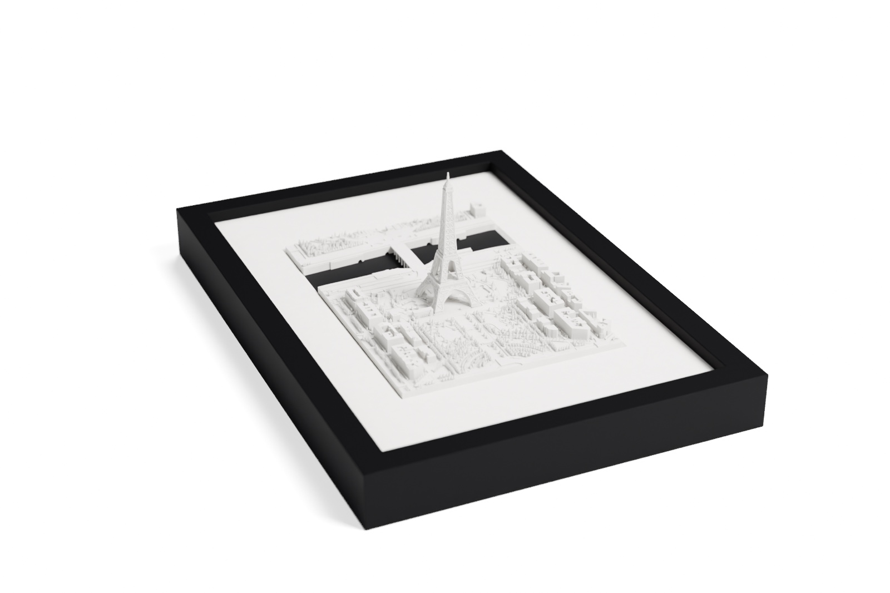
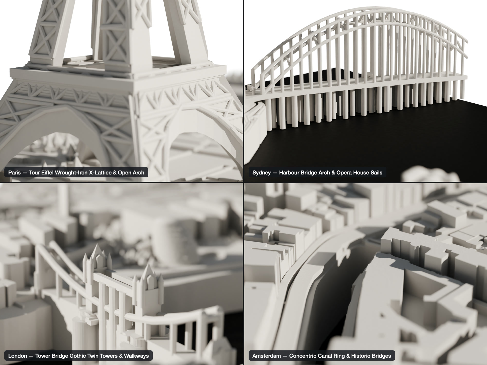
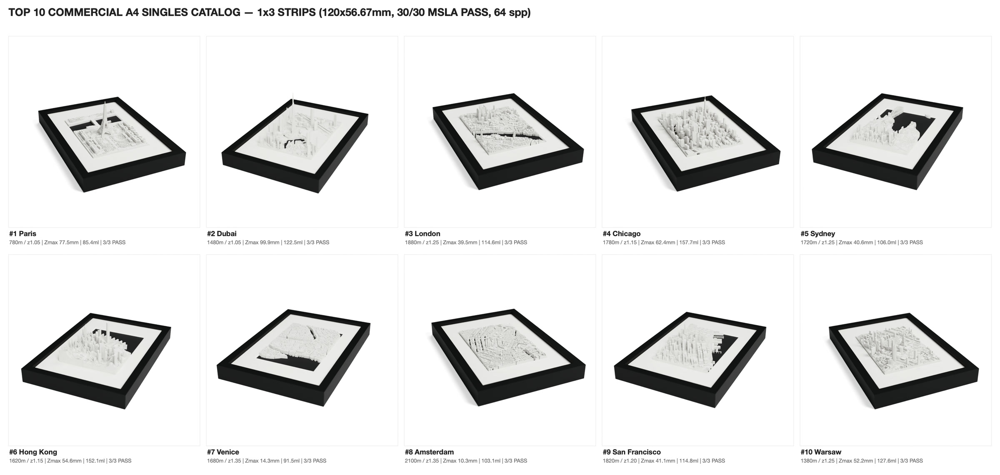
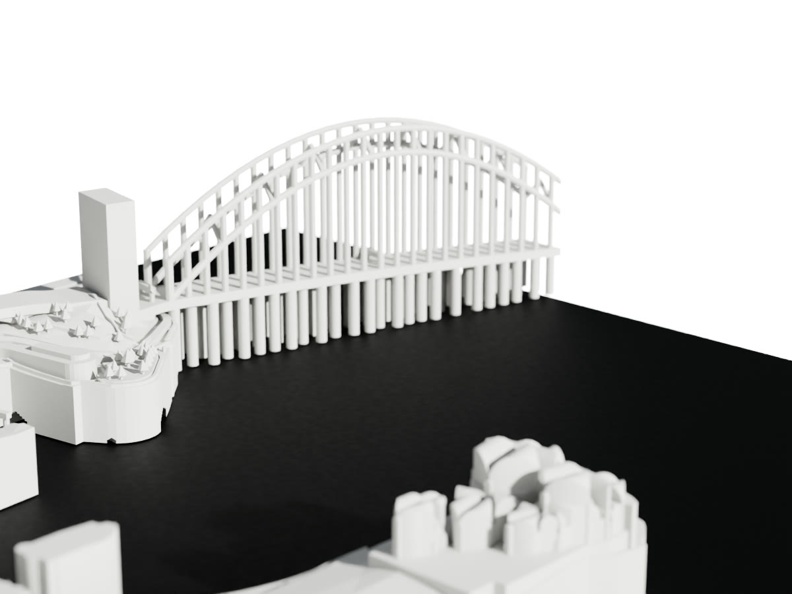
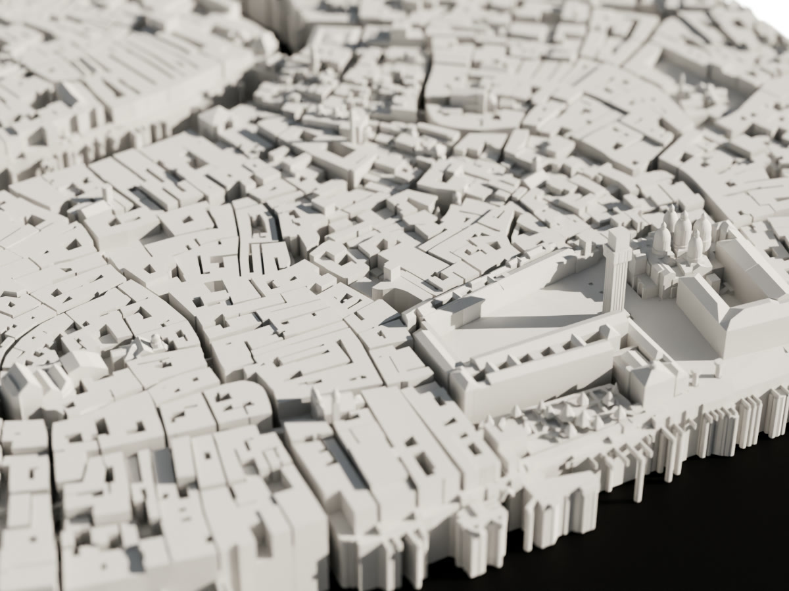
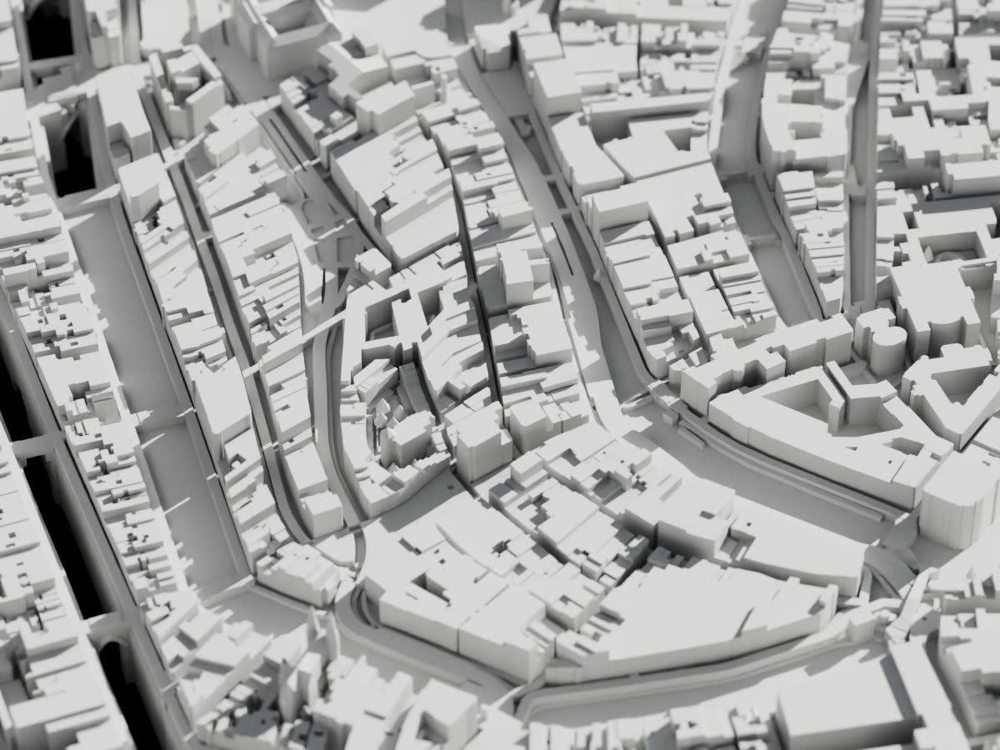
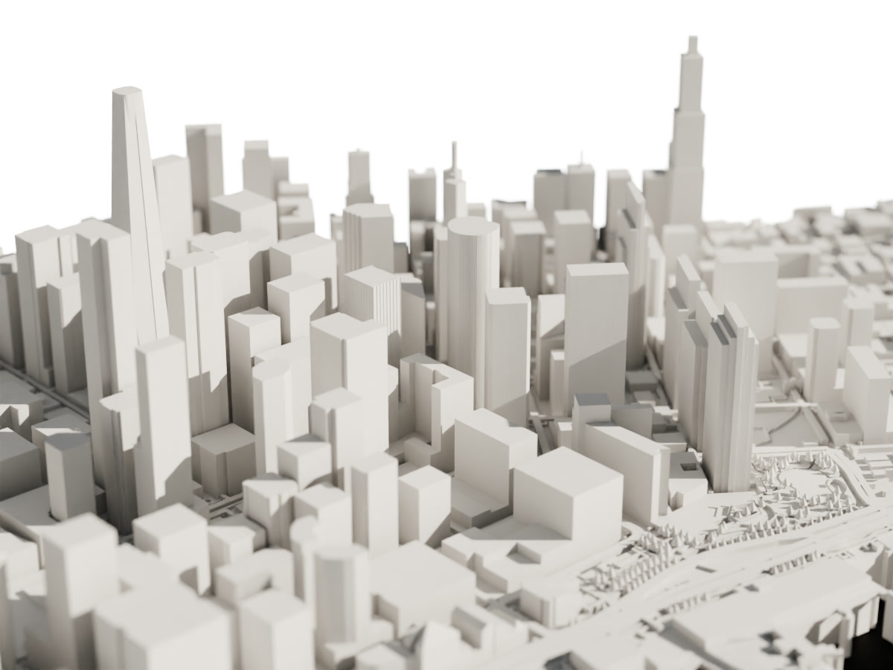
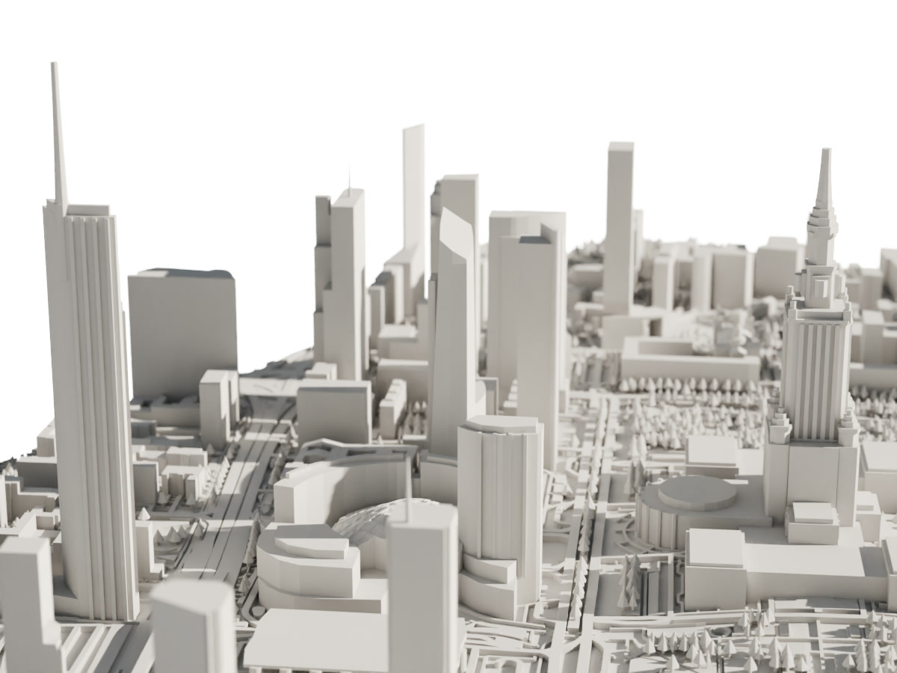

# map-to-3dprint

Convert live OpenStreetMap vectors and AWS Terrarium DEM elevation into watertight `10K` MSLA resin city reliefs.

**Photon Mono 4 (`17 um` XY, `0.100 mm` ABS White) | A4 Passe-Partout (`120x170 mm`, `1x3`) | Zero Supports**



## 10K Resin Detail



## Top 10 A4 Cities



## Close-Up Detail: Every City

| | |
| :---: | :---: |
| <br>**#1 Paris** (`77.54 mm` Z, `81.23 ml`) | <br>**#2 Dubai** (`99.93 mm` Z, `103.50 ml`) |
| <br>**#3 London** (`39.04 mm` Z, `87.11 ml`) | <br>**#4 Chicago** (`61.88 mm` Z, `139.47 ml`) |
| <br>**#5 Sydney** (`40.63 mm` Z, `100.97 ml`) | <br>**#6 Hong Kong** (`54.56 mm` Z, `145.09 ml`) |
| <br>**#7 Venice** (`13.11 mm` Z, `76.64 ml`) | <br>**#8 Amsterdam** (`9.46 mm` Z, `82.96 ml`) |
| <br>**#9 San Francisco** (`41.12 mm` Z, `106.40 ml`) | <br>**#10 Warsaw** (`51.73 mm` Z, `102.65 ml`) |

## MSLA Resin Spec

- **Printer**: Anycubic Photon Mono 4 (`10K`, `17 um` XY pixel pitch, `153.45 x 87.05 x 165.0 mm` bed).
- **Resin profile**: Anycubic ABS-Like Pro 2 White at `0.100 mm` layer height (`Anti-alias Off`).
- **Build orientation**: Print every strip flat at `Z = 0.00 mm` on Flex Plate with zero slicer supports.
- **A4 `1x3` tiling**: Three flush `120 x 56.67 mm` horizontal strips (`Top`, `Middle`, `Bottom`) inside `4.0 mm` safe margins.
- **Verified print gate**: `4.0 mm` solid skirt with underside relief and `0.25 mm` `DFM-06` chamfer. All `10/10` cities pass `validate_assembly.py` (`VAL-01..14`).

## Quick Start

```bash
npm install
python3 build_app.py
npm run test:headless
node tools/export_city_sku.mjs --city paris_true_scale
python3 calibration/validate_assembly.py exports/paris_true_scale_a4_120x170_1x3/assembly_manifest.json
```

## Docs

- [Top 10 Single A4 Catalog and Explorations](docs/single-a4-top10-catalog.md)
- [Photon Mono 4 Slicer Profile (`0.100 mm` ABS White)](docs/mono4-slicer-profile.md)
- [MSLA Printability and Validation Specification](docs/msla-printability-and-validation-spec.md)
- [A4 `1x3` Tile Grid Audit](docs/a4-tile-grid-audit.md)
- [Frameless Chalk-Plaster Detail Gallery Mode](docs/detail-chalk-gallery-mode.md)
- [Blender Cycles Studio and MCP Workflow](docs/blender-studio-workflow.md)
